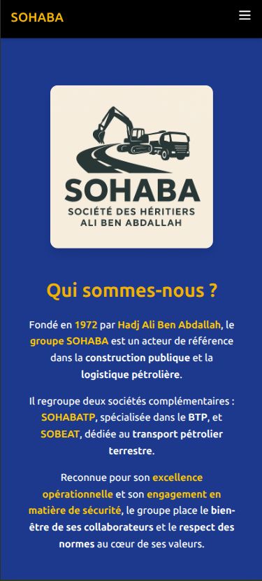
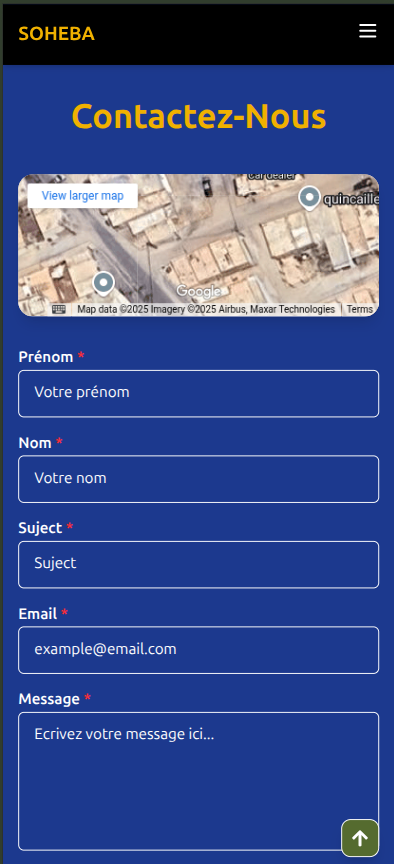
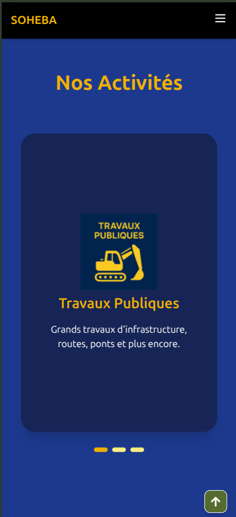

# 🚧 CONTRACTORS APP

## ⚠️ This project is currently in active development.

## ⚠️ THIS PROJECT IS FOR PERSONAL PORTFOLIO USE ONLY. PLEASE DO NOT REUSE OR REDISTRIBUTE ANY PART OF THIS CODE.

* This is an application that serves as the **showcase website** for a contractor company named **Soheba**. 
* It highlights the company's identity, services, and projects. 
* In the future, this application will also include a full-fledged **project management dashboard** for internal use.

# 🔧 Technologies Used

- Angular  v18
- Node.js v20
- Tailwind CS
- TypeScript
- EmailJS ...

# 🚀 Getting Started

### To run the project locally:

- Clone the repo

- npm install

- npm start

# 📷 Screenshots:

  
  
  

