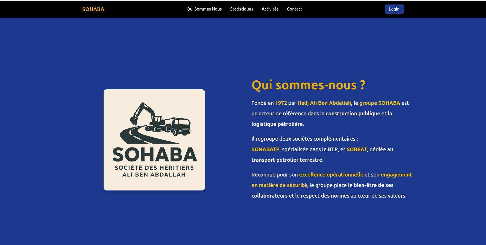
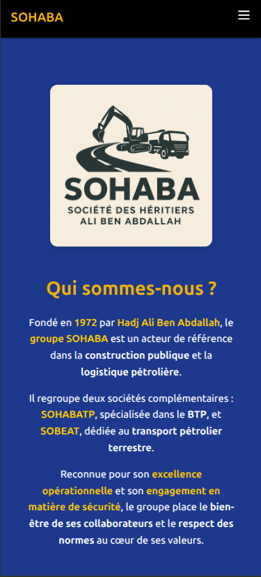
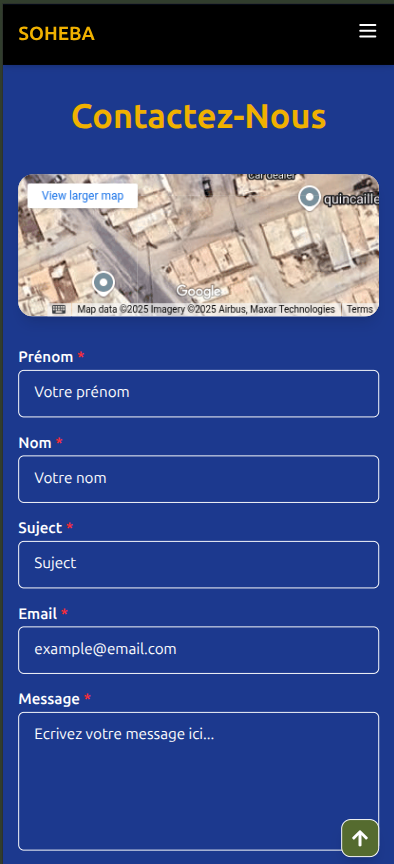
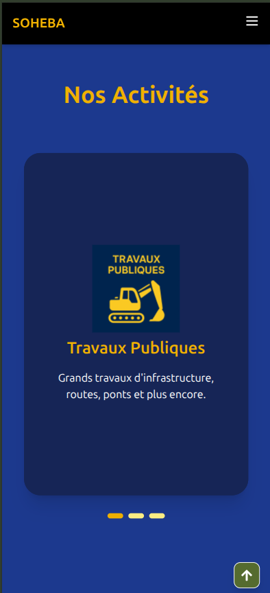

# 🚧 Contractors App

## 📖 About the Project

**Contractors App** is the official showcase website for **Soheba**, a contractor company.

The purpose of this application is to present the company's identity and provide visitors with information about:

- 🏢 Company profile
- 🛠️ Services
- 📂 Numberss
- 📞 Contact information

This project represents the completed version of the company's showcase website. While the application is considered complete, future updates may include minor improvements, refinements, and additional content as needed.

---

## ⚠️ Project Status

✅ Production Ready

The application is fully functional and may receive occasional enhancements or maintenance updates in the future.

---

## 🔒 License

This project was developed as a private application and is showcased here for portfolio purposes only.

The source code, design, assets, and content are proprietary and **may not be copied, modified, redistributed, or reused** without prior permission from the author.

---

## 🛠️ Technologies Used

### Frontend

- Angular 19
- TypeScript
- Tailwind CSS
- Angular Material

### Backend & Services

- Node.js 20
- Express.js
- EmailJS

---

## 🚀 Getting Started

### Clone the repository

```bash
git clone <repository-url>
```

### Install dependencies

```bash
npm install
```

### Run the application

```bash
npm start
```

Open your browser and navigate to:

```
http://localhost:4200
```

---

# 📷 Screenshots

<p align="center">
  
  
  
  
</p>